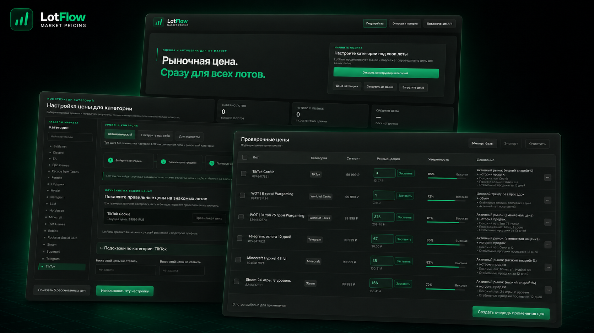
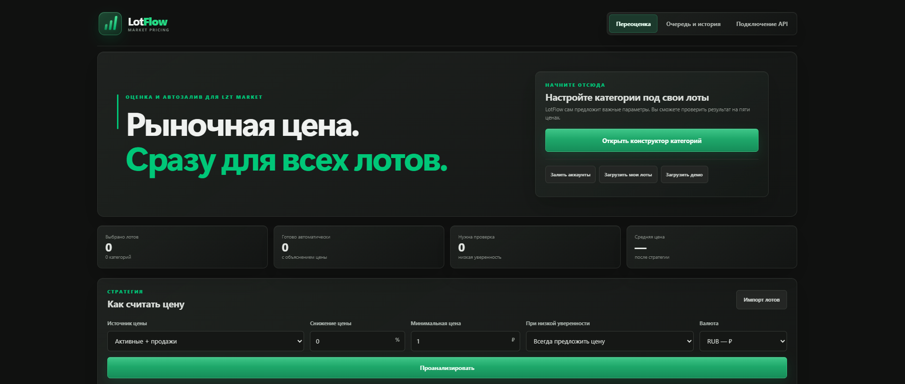
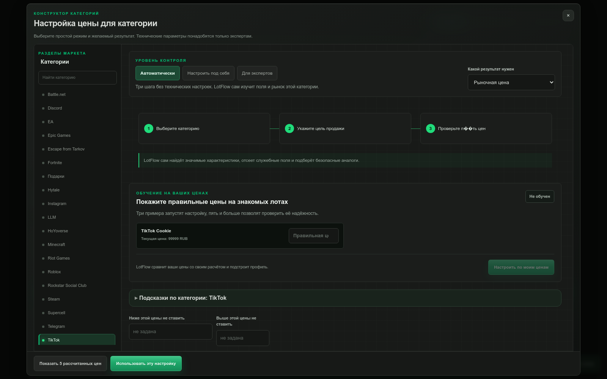
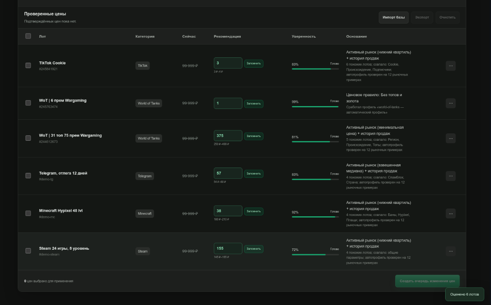

# LotFlow 1.0


<p align="center">
  
</p>

LotFlow помогает продавцам LZT Market переоценивать сразу много лотов. Инструмент загружает аккаунты, ищет рыночные аналоги, предлагает цены с объяснением и после проверки применяет подтверждённые изменения.

## Возможности

- загрузка собственных лотов через LZT Market API;
- поиск и сравнение рыночных аналогов;
- рекомендуемая цена, диапазон и уверенность расчёта;
- отдельные настройки для 24 категорий;
- калибровка по контрольным ценам продавца;
- ручное изменение любой рекомендации;
- очередь подтверждённых изменений;
- массовое применение цен на LZT Market;
- демонстрационный режим без API-токена.

## Скриншоты функционала

### Главный экран и стратегия оценки



### Конструктор категорий



### Результаты оценки и очередь цен



## Запуск на Windows

1. Распакуйте архив.
2. Установите Node.js 20 или новее, если он ещё не установлен.
3. Откройте файл `start.bat`.
4. Введите токен LZT API или нажмите Enter для демонстрационного режима.
5. Откройте http://127.0.0.1:4173.
6. Не закрывайте окно запуска во время работы.

## Запуск на Linux или macOS

1. Откройте папку LotFlow в терминале.
2. Запустите `start.sh`.
3. Введите токен LZT API или нажмите Enter для демонстрационного режима.
4. Откройте http://127.0.0.1:4173.

## Проверка проекта

```bash
npm test
```

В версии 1.0 проходит 175 тестов. На каждый push и pull request запускается GitHub Actions.

## Безопасность

Токен LZT API передаётся приложению локально и не сохраняется в браузере. Не добавляйте токен, файлы окружения, логи и рабочие данные в публичный репозиторий.

## Лицензия

Проект распространяется по лицензии MIT. Подробности находятся в файле `LICENSE`.
